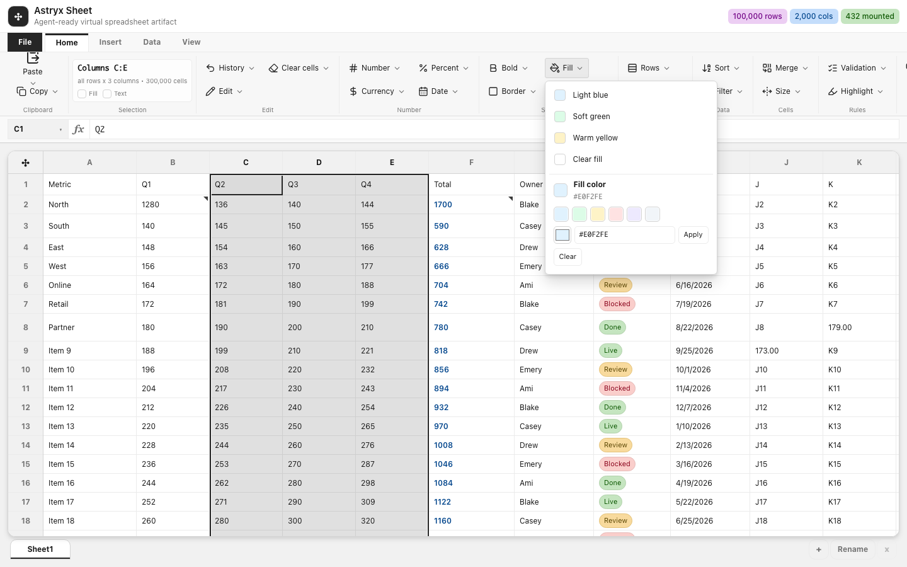

# Astryx Sheet

Astryx Sheet is an open-source virtual spreadsheet editor prototype built with [Astryx](https://astryx.atmeta.com/), React, and Vite.

## Demo

Live demo: https://thedjpetersen.github.io/astryx-sheet/



It demonstrates how to combine design-system primitives with high-performance spreadsheet interaction patterns: large-grid virtualization, fixed headers, editable cells, formulas, multi-cell selection, row/column resizing, and ref-driven hot paths.

## Progressive Adoption

You can adopt Astryx Sheet in layers instead of taking the full demo shell:

- Use the complete Astryx-flavored spreadsheet with `<Spreadsheet />` when you want the grid, formula editor, ribbon, sheet tabs, themes, validation, formatting, and workbook controls in one surface.
- Use the spreadsheet surface with your own product chrome by passing a host-created `workbookController` and hiding optional UI such as the toolbar, stats, theme controls, or theme wrapper.
- Use the headless workbook engine without React for commands, formulas, snapshots, persistence, imports/exports, history, recalculation, and tests.
- Use focused model utilities such as address helpers, formula catalog metadata, formula templates, TSV/HTML/SpreadsheetML adapters, and command builders when you only need one spreadsheet capability.

```jsx
import {CommandType, Spreadsheet, createWorkbookController} from 'astryx-sheet';

const workbookController = createWorkbookController({
  sheets: [{id: 'inputs', name: 'Inputs', rowCount: 100000, colCount: 2000}],
  activeSheetId: 'inputs',
});

workbookController.dispatch({
  type: CommandType.SET_CELL,
  sheetId: 'inputs',
  row: 0,
  col: 0,
  value: 'Revenue',
});

export function EmbeddedSheet({onSave}) {
  return (
    <Spreadsheet
      workbookController={workbookController}
      showToolbar={false}
      showStats={false}
      showThemeControls={false}
      withTheme={false}
      onWorkbookChange={({workbook}) => onSave(workbook)}
    />
  );
}
```

## Features

- Astryx themes and component primitives for the app shell, toolbar, buttons, inputs, badges, tokens, progress, status, and inspector table
- 100,000 × 2,000 logical grid with a small virtualized render window
- Fixed column header and fixed numeric row sidebar
- Sparse `Map`-based row-height and column-width overrides
- Drag multi-cell selection with a DOM overlay updated outside the React render loop
- Row and column resizing with transient dimensions stored in refs
- Undoable row and column size changes committed through the workbook engine
- Editable cells via double-click, `Enter`, typing, formula bar, and context menu
- Undo/redo command history for engine-backed cell edits and clears
- Engine-backed copy/paste for TSV selection data
- Engine-backed HTML table clipboard import/export for richer external spreadsheet paste payloads
- Grouped workbook commands and range-copy helpers for compound undo, metadata-preserving copies, and relative formula translation
- Engine-backed Fill Down and Fill Right helpers that preserve metadata and translate relative formula references, including whole-row and whole-column ranges
- Formula dependency graph utilities for dirty-cell discovery, workbook-level cross-sheet dependencies, literal-safe named ranges, and recalculation ordering
- Cached recalculation helpers for full-sheet and dirty-formula updates
- Command dispatch wrapper that derives changed cells and selectively refreshes dependent formula caches across sheets
- Headless controller calculation modes for automatic recalculation, manual dirty tracking, and selective explicit workbook recalculation
- Multi-sheet formula references resolve through the headless workbook engine, including quoted sheet names
- React spreadsheet cell edits, clears, paste actions, and history navigation use the recalculating engine path
- Inspector metrics for formula cells, cached formula results, and formula errors
- Engine-level number, currency, percent, date, and text formatting with undoable range format commands
- React toolbar actions for applying common engine-backed number formats to the current selection
- Engine-level cell styling for bold text, borders, fill color, text color, and alignment with undo/redo, snapshots, SpreadsheetML style round trips, and grid rendering
- React toolbar actions for applying common engine-backed cell styles to the current selection
- Sparse range-level formats and styles for header-sized selections, so whole columns/rows can receive fill, text color, and number formats without materializing every cell
- Profiler-backed bulk-selection guardrails for large header formatting and sorting paths
- Undoable engine range sorting with header-aware, numeric, date, and text comparison
- React toolbar actions for sorting the selected range by the active column
- CSV, TSV, HTML table, and SpreadsheetML XML import/export helpers for embedding and data interchange, including formulas, sheet dimensions, row/column sizes, number formats, cell styles, notes, hyperlinks, conditional formats, named ranges, and merged ranges
- Workbook-level named ranges with undo/redo, cross-sheet formula resolution, and snapshot serialization
- Named ranges participate in formula dependency tracking and cached recalculation across sheets
- React toolbar actions for creating and removing named ranges from the current selection
- Multi-sheet workbook commands for adding, activating, renaming, and removing sheets with undo/redo
- React sheet tabs for switching, adding, renaming, and removing workbook sheets from the embedded UI
- Undoable engine commands for inserting/deleting rows and columns, with sparse-cell, dimension, metadata, and formula-reference shifting
- Right-click menu actions for fill, inserting/deleting rows, and inserting/deleting columns through the same headless command path
- Sheet filter state with criteria evaluation, visible-row selectors, undo/redo, and snapshot serialization
- React toolbar filtering that collapses hidden rows through the virtualized row metrics
- Merged range metadata with overlap validation, undo/redo, selectors, and snapshot serialization
- React grid rendering for host-provided merged ranges, including row and column spans in the virtual window
- React toolbar actions for creating and clearing workbook merged ranges
- Data validation rules with list, number, and text predicates plus undo/redo and snapshot serialization
- React edit, clear, and paste flows enforce host-provided validation rules and mark invalid visible cells
- React toolbar actions for adding number/list validation rules and clearing active validation rules
- Conditional formatting rules with number, text, blank, and error predicates plus undo/redo, snapshot serialization, structural range shifting, and React grid rendering
- React toolbar actions for adding number/text conditional highlights and clearing conditional formatting
- Cell notes with undo/redo, snapshot serialization, SpreadsheetML comment round trips, copy preservation, grid markers, and context-menu editing
- Cell hyperlinks with undo/redo, snapshot serialization, SpreadsheetML `HRef` round trips, copy preservation, grid styling/tooltips, and context-menu editing/opening
- Inspector metrics for merged ranges, validation rules, and named ranges
- Formula evaluation for aggregates, conditional aggregates including `MINIFS`/`MAXIFS`, lookup/reference helpers including `LOOKUP`/`XMATCH`/`ROW`/`COLUMN`/`ROWS`/`COLUMNS`/`ADDRESS`/`INDIRECT`/`OFFSET`, dynamic-array helpers including `FILTER`/`UNIQUE`/`SORT`/`SEQUENCE`/`TRANSPOSE` with engine-backed spill display and spilled-range references such as `A1#`, `LET` scalar and range variables, `IF`, `IFS`, `SWITCH`, `CHOOSE`, logical predicates, scalar math, text helpers, same-sheet and cross-sheet cell references/ranges including referenced-sheet-bounded whole-column and whole-row ranges, comparisons, and basic arithmetic
- Engine-owned formula catalog used by the React function picker, with reusable formula templates for embedded surfaces
- Google Sheets-style formula entry affordances in React, including keyboard autocomplete across the full engine function catalog, named ranges, and workbook sheet names, model-backed formula token highlighting, colored grid overlays for same-sheet formula references, click/drag range picking that replaces the active reference token, `F4` absolute/relative reference cycling, argument-aware signatures, live engine-backed draft result/error previews, formula diagnostics, searchable function browsing, descriptions, draft/insert flows, and range-aware template previews from the engine-owned catalog
- Formula evaluation for date/time helpers including `TIME`/`TIMEVALUE`/`HOUR`/`MINUTE`/`SECOND`/`DATEVALUE`/`WEEKNUM`/`ISOWEEKNUM`/`DAYS`/`DAYS360`/`YEARFRAC`/`DATEDIF`/`WEEKDAY`/`NETWORKDAYS`/`NETWORKDAYS.INTL`/`WORKDAY`/`WORKDAY.INTL`, text extraction/search/substitution/replacement helpers including `PROPER`/`CHAR`/`CODE`/`CLEAN`/`TEXT`/`FIXED`/`DOLLAR`/`NUMBERVALUE`/`TEXTBEFORE`/`TEXTAFTER`, financial helpers such as `PMT`/`PV`/`FV`/`NPER`/`RATE`/`IPMT`/`PPMT`/`NPV`/`IRR`/`XNPV`/`XIRR`, aggregate helpers such as `PRODUCT`/`SUMSQ`/`COUNTBLANK`/`AVERAGEA`, statistical helpers including percentile/quartile helpers, `MODE.SNGL`, `RANK.EQ`, `RANK.AVG`, `GEOMEAN`, `HARMEAN`, `CORREL`, covariance, regression/forecast helpers, `STDEV.S`/`STDEV.P`/variance, logarithm/trigonometry helpers, combinatoric/math helpers such as `MROUND`/`QUOTIENT`/`GCD`/`LCM`/`COMBIN`/`PERMUT`, and common scalar math helpers
- Formula expressions can combine function calls, cell references, comparisons, and arithmetic in the same formula
- Formula syntax supports Excel-style exponent `^`, postfix percent, and text concatenation with `&`
- Formula evaluation returns and caches spreadsheet errors such as `#DIV/0!`, `#NUM!`, `#VALUE!`, and `#NAME?`
- Volatile formula support for `TODAY`, `NOW`, `RAND`, `RANDBETWEEN`, `INDIRECT`, and `OFFSET`, including dependent-cache recalculation
- Defensive formula helpers including `IFERROR`, `IFNA`, `ISERROR`, `ISNA`, `ISBLANK`, `ISNUMBER`, `ISTEXT`, `ISEVEN`, `ISODD`, `ISFORMULA`, `FORMULATEXT`, `N`, `T`, `TYPE`, and `ERROR.TYPE`
- Right-click context menu for edit, clear, copy, resize, and sample formula actions
- Live inspector panel showing mounted cells, sparse overrides, effect-registered geometry, and approximate FPS
- Demo options for theme selection (default: Neutral), dark mode, inspector visibility, compact row density, and high-contrast selection
- Embeddable source package exports for the React `Spreadsheet` component and a React-independent workbook engine
- React `Spreadsheet` can own an internal headless controller or consume a host-provided `workbookController`
- `onWorkbookChange` callback for host applications that need workbook state after cell, sheet, history, format, conditional format, filter, sort, clipboard, or resize commands
- Headless `createWorkbookController` API for non-React command dispatch, subscriptions, history, calculation modes, recalculation, and snapshots
- Headless `createWorkbookPersistence` helpers for binding controller snapshots to host storage, including an in-memory adapter for tests and non-browser runtimes
- Headless command journal helpers for recording and replaying controller commands in collaboration or audit-log workflows
- SpreadsheetML XML adapter for dependency-free Excel-readable workbook import/export with number-format, cell-style, note/comment, hyperlink, conditional-format, named-range, and merged-range round trips
- Workbook engine primitives for sparse sheets, active-sheet state, cells, formulas, commands, undo/redo, TSV clipboard data, and JSON snapshots

## Why this exists

Spreadsheet UIs are a good stress test for generated React code. Many interactions — drag selection, scroll-linked headers, resize guides — should not push every pixel through React state. This repo keeps workbook semantics in the headless engine/controller while React owns viewport interaction state and uses refs, `requestAnimationFrame`, and direct DOM transforms for frame-by-frame feedback.

```text
React state:
- active cell
- committed selection
- visible virtual window
- persisted edits / dimensions version

Mutable refs:
- live scroll position
- live drag selection extent
- row and cell geometry maps
- sparse row height / column width maps

Direct DOM updates:
- selection overlay transform / size
- resize guide position
- fixed header transforms on scroll
```

## Getting started

```bash
npm install
npm run dev
```

Then open the Vite URL printed in your terminal.

## Useful commands

```bash
npm run dev      # start local development
npm test         # run React-independent workbook engine tests
npm run profile:bulk  # run V8 CPU profiling for bulk header formatting/sort paths
npm run build    # production build
npm run build && rm -f docs/assets/index-*.js docs/assets/index-*.css && cp dist/index.html docs/index.html && cp dist/assets/* docs/assets/  # refresh GitHub Pages demo files
npm run preview  # preview the production build
```

## Project structure

```text
src/main.jsx                    # Vite demo bootstrap
src/index.js                    # package exports for embedding
src/app/                        # demo app + Astryx theme registry
src/spreadsheet/Spreadsheet.jsx # embeddable spreadsheet component
src/spreadsheet/components/     # toolbar, cells, menus, inspector, picker
src/spreadsheet/engine/         # workbook core, controller, persistence, commands, undo/redo, clipboard
src/spreadsheet/model/          # addresses, formulas, dimensions, selections
src/hooks/                      # reusable React runtime hooks
test/                           # engine behavior tests runnable with node:test
index.html                      # Vite entry point
package.json                    # scripts, dependencies, source exports
```

See [docs/architecture.md](docs/architecture.md) for the current extension boundaries and the intended path toward a full workbook engine.

## Notes

This is still a staged implementation, not complete Excel parity. The current focus is a durable embeddable foundation: a performant virtualized React surface backed by a growing workbook engine that can eventually own Excel-scale behavior.

## License

MIT
